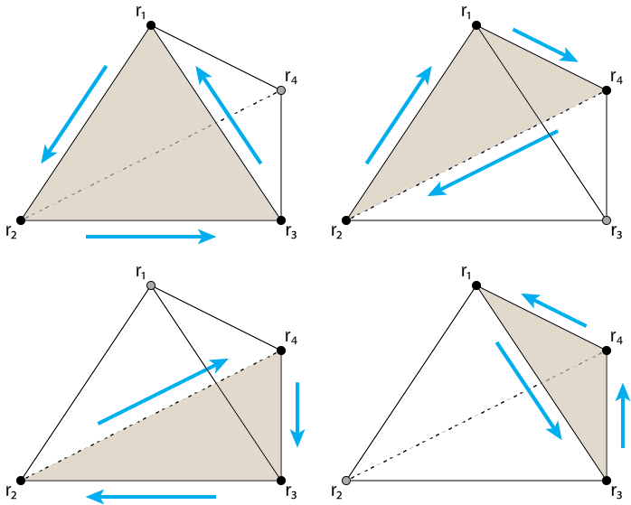

The libfabbri functions
=======================

These functions can be used to evaluate integrals in Fabbri's 2008 and 2009 papers :cite:p:`fabbri:2008, fabbri:2009`.
For tetrahedra, the triangle face-windings are assumed to be the same as figure 1. For cubes the face winding is
assumed to be the same as figure 2.

.. doxygenfile:: fabbri.hpp
